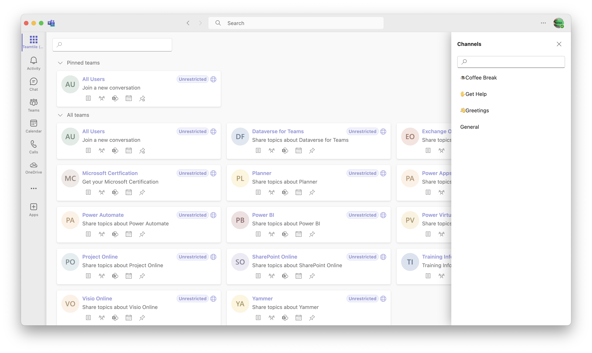

# Teamtile

参加中のチームをタイルで表示することで素早くアクセスできます。

[](https://github.com/karamem0/teamtile/actions/workflows/production.yml)
[](https://github.com/karamem0/teamtile/actions/workflows/development.yml)
[](https://github.com/karamem0/teamtile/blob/main/LICENSE)

## 機能

チームを探すのにイライラしていませんか? Teamtile は以下の機能を提供します。

- 参加中のチームをタイルで表示
- チームのメンバーとチャンネルを表示
- SharePoint ドキュメント ライブラリへのリンク
- チーム、チャネル、メンバーのフィルター

## スクリーンショット



## インストール

### Azure Web アプリの作成

1. [Azure ポータル](https://portal.azure.com) に移動します。

2. **≡** - **リソースの作成** をクリックします。

3. **Web アプリ** をクリックします。

4. 情報を入力して **確認および作成** をクリックします。

    |項目|値|
    |-|-|
    |サブスクリプション|(選択可能)|
    |リソース グループ|(選択可能)|
    |名前|(選択可能)|
    |公開|コード|
    |ランタイム スタック|.NET 7|
    |オペレーティング システム|Windows|
    |地域|(選択可能)|

5. **作成** をクリックして操作が完了するまで待機します。

### Azure AD アプリケーションの登録

1. [Azure ポータル](https://portal.azure.com) に移動します。

2. **≡** - **Azure Active Directory** をクリックします。

3. **アプリの登録** - **新規登録** をクリックします。

4. 情報を入力して **登録** をクリックします。

    |項目|値|
    |-|-|
    |名前|Teamtile|
    |サポートされているアカウントの種類|シングル テナント|

5.  **認証** をクリックしてプラットフォームを追加します。

    |項目|値|
    |-|-|
    |種類|シングル ページ アプリケーション|
    |リダイレクト URL|`[Azure Web アプリの URL]`/auth/callback|
    |アクセス トークン|チェックする|
    |ID トークン|チェックす津|

6. **証明書とシークレット** をクリックしてシークレットを追加します。

7. **API のアクセス許可** をクリックしてアクセス許可を追加します。

    |API|アクセス許可|種類|
    |-|-|-|
    |Microsoft Graph|Channel.ReadBasic.All|委任されたアクセス許可|
    ||Group.Read.All|委任されたアクセス許可|
    ||Team.ReadBasic.All|委任されたアクセス許可|
    ||TeamMember.Read.All|委任されたアクセス許可|
    ||User.Read|委任されたアクセス許可|
    ||User.ReadBasic.All|委任されたアクセス許可|

8. **API の公開** をクリックしてスコープとクライアント アプリケーションを追加します。

    **スコープ**

    |項目|値|
    |-|-|
    |アプリケーション ID URL|api://`[Azure Web アプリ のドメイン名]`/`[アプリケーション ID]`|
    |スコープ名|user_impersonation|
    |同意できるユーザー|管理者とユーザー|
    |管理者の同意の表示名|Teamtile へのアクセス|
    |管理者の同意の説明|サインインしたユーザーの代わりに Teamtile にアクセスすることをアプリケーションに許可します。|
    |ユーザーの同意の表示名|Teamtile へのアクセス|
    |ユーザーの同意の説明|サインインしたユーザーの代わりに Teamtile にアクセスすることをアプリケーションに許可します。|
    |状態|有効|

    **クライアント アプリケーション**

    |アプリケーション|スコープ|
    |-|-|
    |1fec8e78-bce4-4aaf-ab1b-5451cc387264|user_impersonation|
    |5e3ce6c0-2b1f-4285-8d4b-75ee78787346|user_impersonation|

### Application Insights の作成 (オプション)

1. [Azure ポータル](https://portal.azure.com) に移動します。

2. **≡** - **リソースの作成** をクリックします。

3. **Application Insights** を検索して **作成** をクリックします。

4. 情報を入力して **確認および作成** をクリックします。

    |項目|値|
    |-|-|
    |サブスクリプション|(Azure Web App と同じ)|
    |リソース グループ|(Azure Web App と同じ)|
    |名前|(選択可能)|
    |地域|(Azure Web App と同じ)|
    |リソース モード|ワークスペース ベース|
    |Log Analytics ワークスペース|(選択可能)|

5. **作成** をクリックして操作が完了するまで待機します。

### アプリケーションのビルド

#### アプリケーション

1. `source/client` フォルダーに移動します。

2. `.env` ファイルを編集します。

    |項目|値|必須|
    |-|-|-|
    |{{AppId}}|`[アプリケーション ID]`|はい|
    |{{TenantId}}|`[テナント ID]`|はい|
    |{{TelemetryConnectionString}}|`[Application Insights の接続文字列]`|いいえ|

3. `source/server` フォルダーに移動します。

4. `appsettings.json` ファイルを編集します。

    |項目|値|必須|
    |-|-|-|
    |{{Audience}}|api://`[Azure Web アプリのドメイン名]`/`[アプリケーション ID]`|はい|
    |{{AppId}}|`[アプリケーション ID]`|はい|
    |{{AppSecret}}|`[アプリケーション シークレット]`|はい|
    |{{TenantId}}|`[テナント ID]`|はい|
    |{{TelemetryConnectionString}}|`[Application Insights の接続文字列]`|いいえ|

5. アプリケーションをビルドします。

```
dotnet publish --configuration Release
```

4. `publish` フォルダーの中身を圧縮します。

```
Compress-Archive -Path ./bin/Release/net7.0/publish/* -DestinationPath ../../build.zip
```

### マニフェスト

1. `manifest` フォルダーに移動します。

2. `manifest.json` ファイルを編集します。

    |項目|値|
    |-|-|
    |{{AppDomain}}|`[Azure Web アプリのドメイン名]`|
    |{{AppId}}|`[アプリケーション ID]`|

3. `manifest` フォルダーの中身を圧縮します。

```
Compress-Archive -Path ./* -DestinationPath ../manifest.zip
```

## アプリケーションのデプロイ

### Azure Web アプリ

1. [Azure ポータル](https://portal.azure.com) に移動します。

2. **≡** - **すべてのリソース** - **`Azure Web アプリ`** をクリックします。

3. **高度なツール** - **移動** をクリックします。

4. **デバッグ コンソール** - **PowerShell** をクリックします。

5. `site\wwwroot` フォルダーに移動します。

6. `build.zip` ファイルをアップロードします (ブラウザーにドラッグ & ドロップします)。

### Microsoft Teams アプリ

1. [Microsoft Teams 管理センター](https://admin.teams.microsoft.com/) に移動します。

2. **Teams のアプリ** - **アプリを管理** をクリックします。

3. **アップロード** をクリックして `manifest.zip` を選択します。
