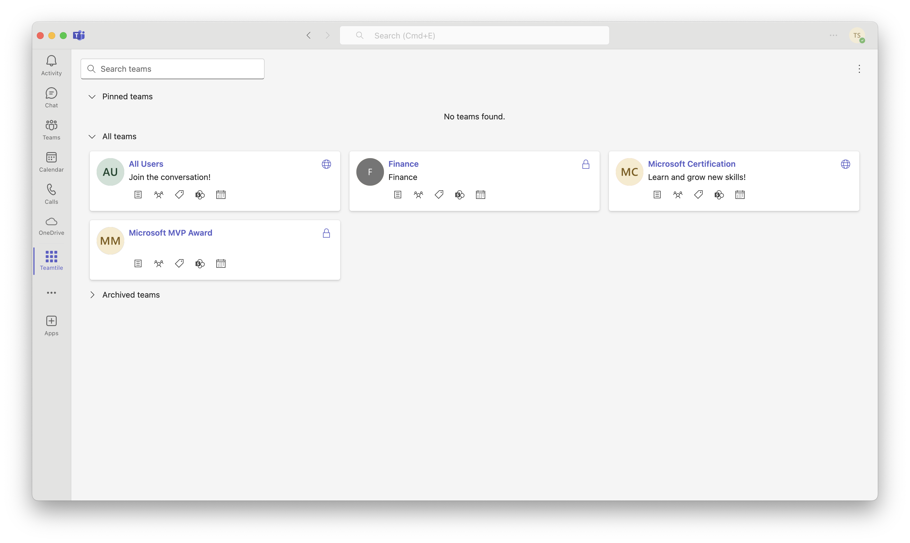
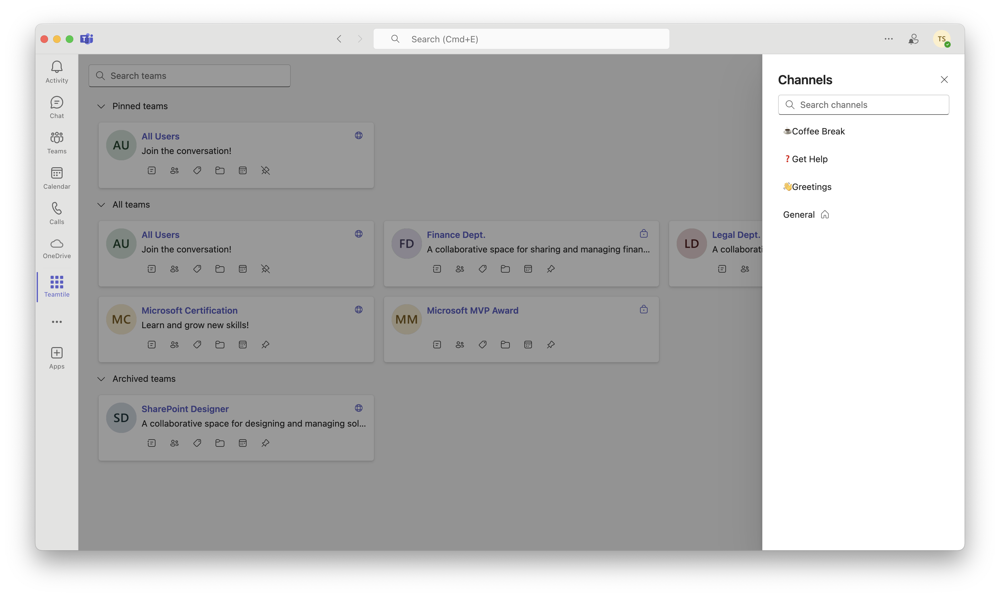
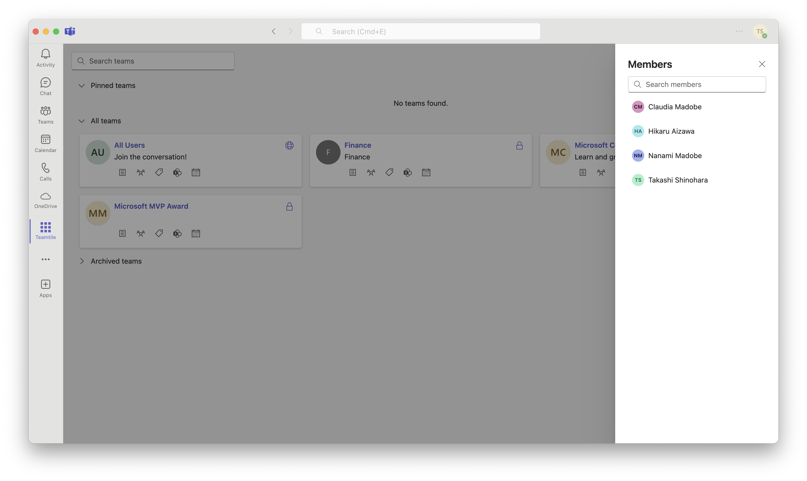

# Teamtile

You can quickly access participating teams by displaying them as tiles.

[](https://github.com/karamem0/teamtile/actions/workflows/trigger.yml)
[](https://codecov.io/gh/karamem0/teamtile)
[](https://github.com/karamem0/teamtile/blob/main/LICENSE)

## Features

Are you frustrated with finding a team? Teamtile provides these features to you😊:

- 🧱Display participating teams as tiles
- 📖Show team members and channels
- 📁Navigate to files (SharePoint Document Library)
- 📅Access the Channel Calendar
- 🪄Filter teams, channels, and members
- 📌Pin favorite teams

## Screenshot







## Installation

### Create Azure Web App

1. Go to [Azure Portal](https://portal.azure.com).

2. Click **≡** - **Create a resource**.

3. Click **Web App**.

4. Enter the information and click **Review + create**.

    |Parameter|Value|
    |-|-|
    |Subscription|(You can choose)|
    |Resource Group|(You can choose)|
    |Name|(You can choose)|
    |Publish|Code|
    |Runtime stack|.NET 8|
    |Operating System|Windows or Linux (You can choose)|
    |Region|(You can choose)|

5. Click **Create** and wait until creation is completed.

### Register Microsoft Entra ID Application

1. Go to [Azure Portal](https://portal.azure.com).

2. Click **≡** - **Microsoft Entra ID**.

3. Click **App registrations** - **New registration**.

4. Enter information and click **Register**.

    |Parameter|Value|
    |-|-|
    |Name|Teamtile|
    |Supported account types|Single tenant|

5. Click **Authentication** and add a platform.

    |Parameter|Value|
    |-|-|
    |Type|Single-page application|
    |Redirect URL|**URL of Azure Web App**/auth/callback|
    |Access tokens|Checked|
    |ID tokens|Checked|

6. Click **Certificates & secrets** and add a client secret.

7. Click **API permissions** and add permissions.

    |API|Permission|Type|
    |-|-|-|
    |Microsoft Graph|Channel.ReadBasic.All|Delegate|
    ||Group.Read.All|Delegate|
    ||Team.ReadBasic.All|Delegate|
    ||TeamMember.Read.All|Delegate|
    ||User.Read|Delegate|
    ||User.ReadBasic.All|Delegate|

8. Click **Expose an API** and add a scope and client applications.

    **Scope**

    |Parameter|Value|
    |-|-|
    |Application ID URL|api://**Domain name of Azure Web App**/**Application ID**|
    |Scope name|user_impersonation|
    |User|Admins and users|
    |Admin consent display name|Access Teamtile|
    |Admin consent description|Allow the application to access Teamtile on behalf of the signed-in user.|
    |User consent display name|Access Teamtile|
    |User consent description|Allow the application to access Teamtile on behalf of the signed-in user.|
    |State|Enabled|

    **Client application**

    |Application|Scope|
    |-|-|
    |1fec8e78-bce4-4aaf-ab1b-5451cc387264|user_impersonation|
    |5e3ce6c0-2b1f-4285-8d4b-75ee78787346|user_impersonation|

### Create Application Insights (Optional)

1. Go to [Azure Portal](https://portal.azure.com).

2. Click **≡** - **Create a resource**.

3. Search **Application Insights** and click **Create**.

4. Enter the information and click **Review + create**.

    |Parameter|Value|
    |-|-|
    |Subscription|(Same as Azure Web App)|
    |Resource Group|(Same as Azure Web App)|
    |Name|(You can choose)|
    |Region|(Same as Azure Web App)|
    |Resource Mode|Workspace-based|
    |Log Analytics Workspace|(You can choose)|

5. Click **Create** and wait until creation is completed.

### Build Application

### Application

1. Go to `source/client` folder.

2. Edit `.env` file.

    |Placeholder|Replace|
    |-|-|
    |`{{APP_CLIENT_ID}}`|**Application ID**|
    |`{{APP_DOMAIN_NAME}}`|**Domain name of Azure Web App**|
    |`{{APP_TENANT_ID}}`|**Tenent ID**|
    |`{{TELEMETRY_CONNECTION_STRING}}`|**Connection String of Application Insights**|

3. Go to `source/server` folder.

4. Edit `appsettings.json` file.

    |Placeholder|Replace|
    |-|-|
    |`{{APP_CLIENT_ID}}`|**Application ID**|
    |`{{APP_CLIENT_SECRET}}`|**Application Secret**|
    |`{{APP_TENANT_ID}}`|**Tenent ID**|
    |`{{TELEMETRY_CONNECTION_STRING}}`|**Connection String of Application Insights**|

5. Build application.

```
dotnet publish --configuration Release
```

4. Compress contents of `publish` folder.

```
Compress-Archive -Path ./bin/Release/net8.0/publish/* -DestinationPath ../../build.zip
```

### Manifest

1. Go to `manifest` folder.

2. Edit `manifest.json` file.

    |Placeholder|Replace|
    |-|-|
    |`{{APP_DOMAIN_NAME}}`|**Domain name of Azure Web App**|
    |`{{APP_CLIENT_ID}}`|**Application ID**|

3. Compress contents of `manifest` folder.

```
Compress-Archive -Path ./* -DestinationPath ../manifest.zip
```

## Deploy Application

### Azure Web App

1. Go to [Azure Portal](https://portal.azure.com).

2. Click **≡** - **All resources** - **`Azure Web App`**.

3. Click **Advanced Tools** - **Go**.

4. Click **Debug console** - **PowerShell**.

5. Go to `site\wwwroot` folder.

6. Upload `build.zip` file (Drag the file into the browser).

### Microsoft Teams App

1. Go to [Microsoft Teams Admin Center](https://admin.teams.microsoft.com/).

2. Click **Teams apps** - **Manage apps**.

3. Click **Upload** and select `manifest.zip` file.

## Assets

The assets are licensed by [unDraw](https://undraw.co/illustrations).
