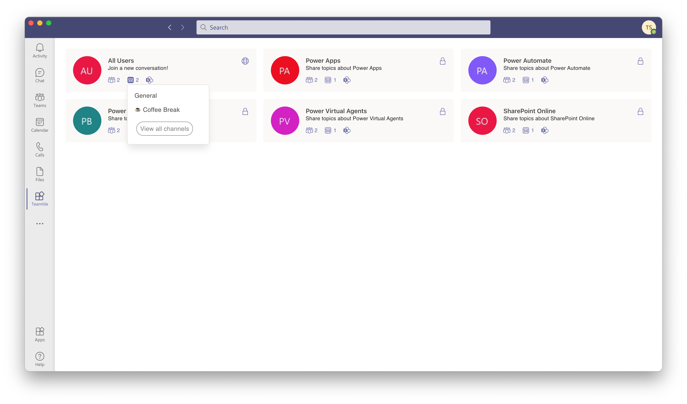

# Teamtile

Display joined teams in tile view and access quickly.

## Features

Teamtile is a Microsoft Teams App that provides these features to you:

- View joined teams
- View team members and channels
- Link to SharePoint Document Library

## Screenshot



## Installation

### Create Azure Web App

1. Go to [Azure Portal](https://portal.azure.com).

2. Click \[≡\] - \[Create a resource\].

3. Click \[Web App\].

4. Enter the information and click \[Review + create\].

    |Parameter|Value|
    |-|-|
    |Subscription|(You can choose)|
    |Resource Group|(You can choose)|
    |Name|(You can choose)|
    |Publish|Code|
    |Runtime stack|.NET 5 (Early Access)|
    |Operating System|Windows|
    |Region|(You can choose)|

5. Click \[Create\] and wait until creation is completed.

6. Click \[Configuration\] - \[Path mappings\] and add a virtual application.

    |Virtual path|Physical path|Type|
    |-|-|-|
    |/api|site\wwwroot\api|Application|

### Register Azure AD Application

1. Go to [Azure Portal](https://portal.azure.com).

2. Click \[≡\] - \[Azure Active Directory\].

3. Click \[App registrations\] - \[New registration\].

4. Enter information and click \[Register\].

    |Parameter|Value|
    |-|-|
    |Name|Teamtile|
    |Supported account types|Single tenant|

5. Click \[Authentication\] and add a platform.

    |Parameter|Value|
    |-|-|
    |Type|Web|
    |Redirect URL|`[URL of Azure Web App]`/auth/callback|
    |Access tokens|Checked|
    |ID tokens|Checked|

6. Click \[Certificates & secrets\] and add a client secret.

7. Click \[API permissions\] and add permissions.
    |API|Permission|Type|
    |-|-|-|
    |Microsoft Graph|Channel.ReadBasic.All|Delegate|
    ||Group.Read.All|Delegate|
    ||openid|Delegate|
    ||profile|Delegate|
    ||Team.ReadBasic.All|Delegate|
    ||TeamMember.Read.All|Delegate|
    ||User.Read|Delegate|
    ||User.ReadBasic.All|Delegate|

8. Click \[Expose an API\] and add a scope and client applications.

    **Scope**

    |Parameter|Value|
    |-|-|
    |Application ID URL|api://`[Domain name of Azure Web App]`/`[Application ID]`|
    |Scope name|user_impersonation|
    |User|Admins and users|
    |Admin consent display name|Access Teamtile|
    |Admin consent description|Allow the application to access Teamtile on behalf of the signed-in user.|
    |User consent display name|Access Teamtile|
    |User consent description|Allow the application to access Teamtile on behalf of the signed-in user.|
    |State|Enabled|

    **Client application**

    |Application|Scope|
    |-|-|
    |1fec8e78-bce4-4aaf-ab1b-5451cc387264|user_impersonation|
    |5e3ce6c0-2b1f-4285-8d4b-75ee78787346|user_impersonation|

### Build Application

#### Server

1. Go to `source/server` folder.

2. Edit `appSettings.json` file.

    |Parameter|Value|
    |-|-|
    |{{ClientId}}|`[Application ID]`|
    |{{ClientSecret}}|`[Application Secret]`|

3. Build application.

```
dotnet publish --configuration Release
```

4. Compress contents of `publish` folder.

```
Compress-Archive -Path ./bin/Release/net5.0/publish/* -DestinationPath ../../server.zip
```

### Client

1. Go to `source/client` folder.

2. Edit `.env` file.

    |Parameter|Value|
    |-|-|
    |{{DomainName}}|`[Domain name of Azure Web App]`|
    |{{ClientId}}|`[Application ID]`|

3. Build application.

```
npm install
npm run build
```

4. Copy `web.config` file to `build` folder.

5. Compress contents of `build` folder.

```
Compress-Archive -Path ./build/* -DestinationPath ../../client.zip
```

### Manifest

1. Go to `manifest` folder.

2. Edit `manifest.json` file.

    |Parameter|Value|
    |-|-|
    |{{DomainName}}|`[Domain name of Azure Web App]`|
    |{{ClientId}}|`[Application ID]`|

3. Compress contents of `manifest` folder.

```
Compress-Archive -Path ./* -DestinationPath ../manifest.zip
```

## Deploy Application

### Azure Web App

1. Go to [Azure Portal](https://portal.azure.com).

2. Click \[≡\] - \[All resources\] - \[`Azure Web App`\].

3. Click \[Advanced Tools\] - \[Go\].

4. Click \[Debug console\] - \[PowerShell\].

5. Go to `site\wwwroot` folder.

6. Upload `client.zip` file (Drag the file into the browser).

7. Click \[+\] - \[New folder\] and add `api` folder.

8. Go to `api` folder.

9. Upload `server.zip` file (Drag the file into the browser).

### Microsoft Teams App

1. Go to [Microsoft Teams Admin Center](https://admin.teams.microsoft.com/).

2. Click \[Teams apps\] - \[Manage apps\].

3. Click \[Upload\] and select `manifest.zip` file.
